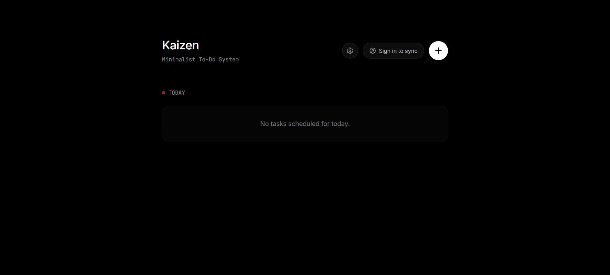
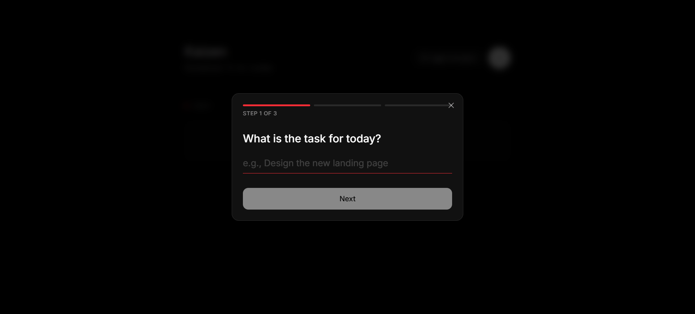
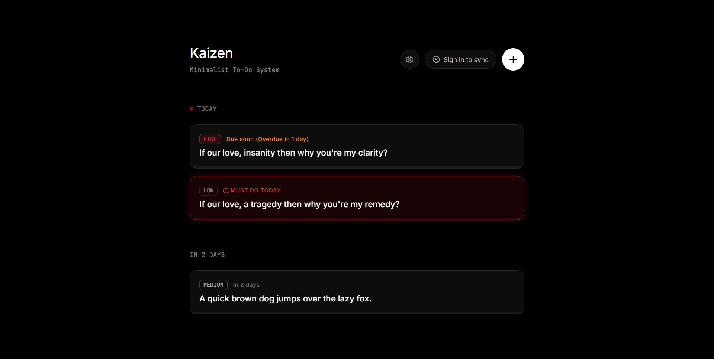

<div align="center">
  <h1>🌸 Kaizen</h1>
  <p><em>A Minimalist To-Do System</em></p>
  <p>Continuous improvement, one task at a time.</p>
</div>

---

## Screenshots

<div align="center">
  


  
  

  


  

</div>

---

## Overview

Kaizen is an intelligent to-do list application designed to automate daily planning using productivity heuristics. Inspired by the philosophy of continuous improvement (*改善*), Kaizen reduces decision fatigue by automatically scheduling tasks based on priority, deadlines, and adaptive repetition rules.

## Features

### 🧠 Smart Scheduling

The system automatically organizes your tasks so you don't have to:

| Priority | Schedule Rule |
|----------|--------------|
| **High** | Always scheduled for TODAY |
| **Medium** | Every 2 days |
| **Low** | Every 3 days |
| **Overdue** | Forced back to TODAY |

### ⚠️ Deadline Constraint Detection

When a task's deadline is too close to follow its normal cycle, the system:
1. Detects the infeasible scheduling window
2. Forces the task into TODAY
3. Notifies you with a clear warning

> *"This task must be done today as it cannot be further scheduled."*

### ⏱️ Pomodoro Timer

Click **DO** on any task to start a focused 25-minute work session. Progress is tracked and saved automatically.

### 👤 Account Sync

| Mode | Storage | Cross-Device Sync |
|------|---------|-------------------|
| **Guest** | LocalStorage | ❌ |
| **Authenticated** | Supabase Cloud | ✅ |

Sign up anytime to sync your tasks across devices. Guest sessions can be upgraded — local tasks are uploaded automatically.

## Tech Stack

| Layer | Technology |
|-------|-----------|
| **Frontend** | React + TypeScript |
| **Build Tool** | Vite |
| **Styling** | Tailwind CSS v4 |
| **Animations** | Framer Motion (`motion/react`) |
| **Database & Auth** | Supabase |
| **Date Handling** | date-fns |
| **Icons** | Lucide React |

## Run Locally

**Prerequisites:** Node.js

1. Clone the repository:
   ```bash
   git clone https://github.com/rEifun30/Kaizen-Minimalist-To-Do-List-System.git
   cd Kaizen-Minimalist-To-Do-List-System
   ```

2. Install dependencies:
   ```bash
   npm install
   ```

3. Create a `.env` file with your Supabase credentials:
   ```env
   VITE_SUPABASE_URL=your_supabase_url
   VITE_SUPABASE_PUBLISHABLE_DEFAULT_KEY=your_supabase_anon_key
   ```

4. Set up the database in your Supabase SQL Editor:
   ```sql
   CREATE TABLE tasks (
     id TEXT PRIMARY KEY,
     user_id UUID REFERENCES auth.users(id) NOT NULL,
     title TEXT NOT NULL,
     priority TEXT NOT NULL,
     deadline TEXT,
     created_at TEXT NOT NULL,
     next_schedule_date TEXT NOT NULL,
     progress INTEGER NOT NULL DEFAULT 0,
     status TEXT NOT NULL DEFAULT 'active',
     last_completed_at TEXT,
     constraint_flag BOOLEAN DEFAULT false,
     constraint_reason TEXT
   );

   ALTER TABLE tasks ENABLE ROW LEVEL SECURITY;

   CREATE POLICY "Users can only access their own tasks"
     ON tasks FOR ALL
     USING (auth.uid() = user_id);
   ```

5. Run the development server:
   ```bash
   npm run dev
   ```

## Project Structure

```
src/
├── components/
│   ├── AuthPage.tsx        # Login/signup with animated transitions
│   ├── PomodoroTimer.tsx   # Focus timer + progress tracking
│   ├── SplashScreen.tsx    # Animated splash with sakura bloom
│   ├── TaskForm.tsx        # Guided task creation flow
│   └── TaskItem.tsx        # Task card with animations
├── hooks/
│   ├── useAuth.ts          # Supabase auth state management
│   └── useTasks.ts         # Task CRUD with cloud/local sync
├── lib/
│   ├── taskUtils.ts        # Scheduling & constraint logic
│   └── utils.ts            # General utility functions
├── utils/
│   └── supabase.ts         # Supabase browser client
├── types.ts                # TypeScript type definitions
├── App.tsx                 # Main app with auth guard
├── index.css               # Tailwind + global styles
└── main.tsx                # Entry point
```

## Data Model

### User (Supabase Auth)
| Field | Type |
|-------|------|
| id | UUID |
| email | String |
| created_at | Timestamp |

### Task
| Field | Type | Description |
|-------|------|-------------|
| id | String | Unique identifier |
| user_id | UUID | Owner (Supabase auth.users) |
| title | String | Task name |
| priority | Enum | high / medium / low |
| deadline | String | Optional ISO date |
| created_at | String | Creation timestamp |
| next_schedule_date | String | Next appearance date |
| progress | Number | 0–100 |
| status | Enum | active / completed |
| last_completed_at | String | Last completion time |
| constraint_flag | Boolean | Deadline constraint active |
| constraint_reason | String | Constraint notification message |

## License

MIT
